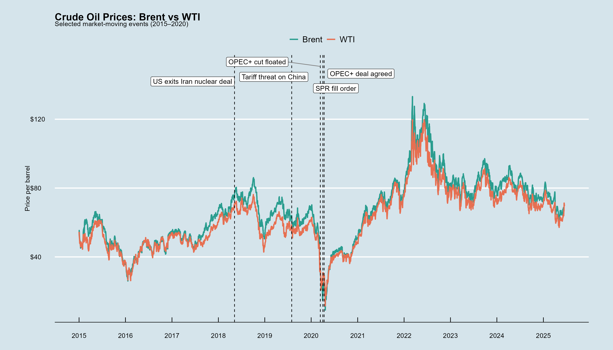
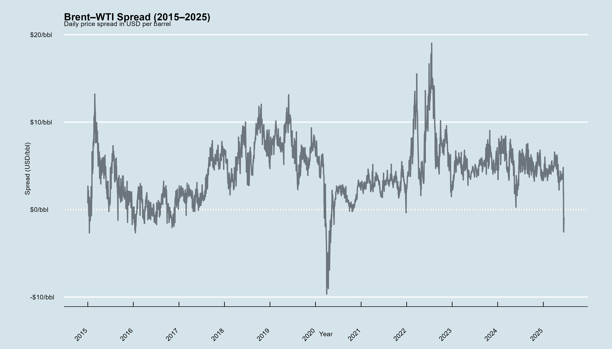
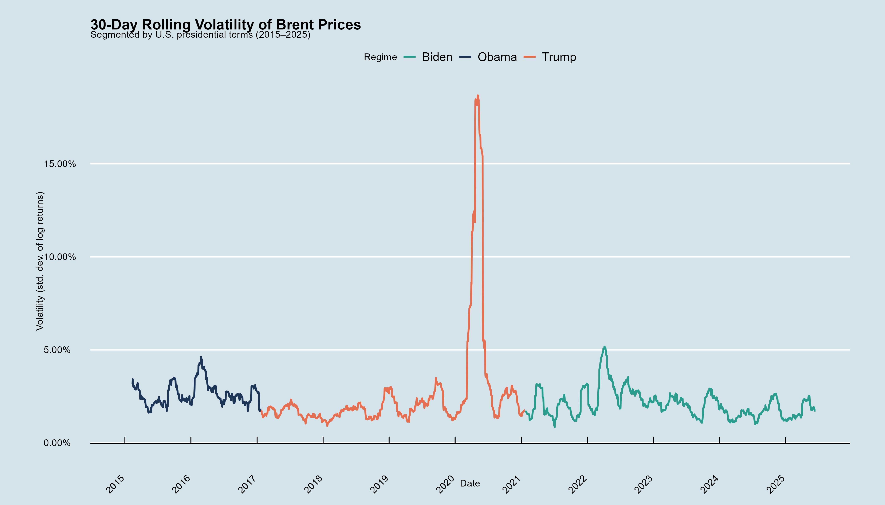
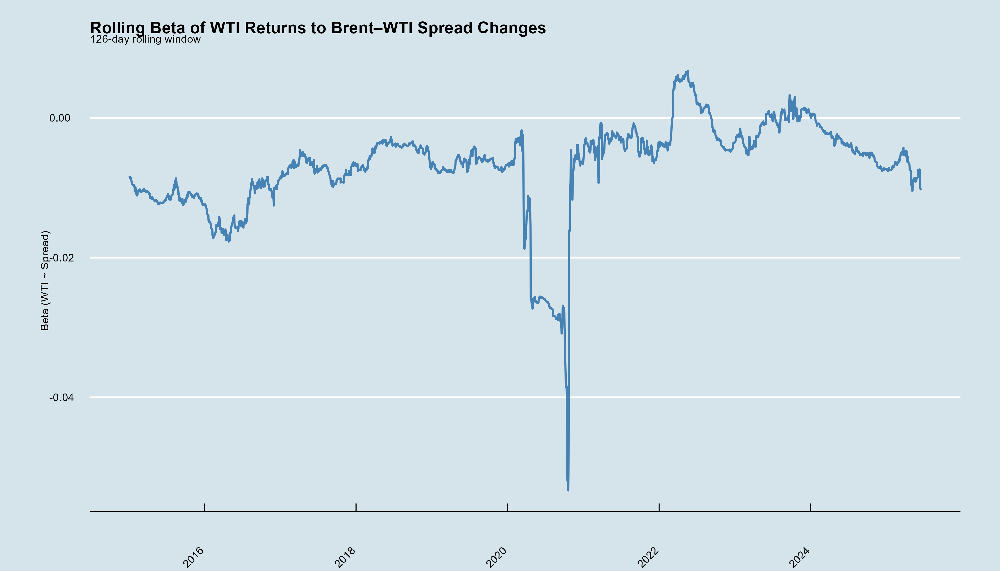
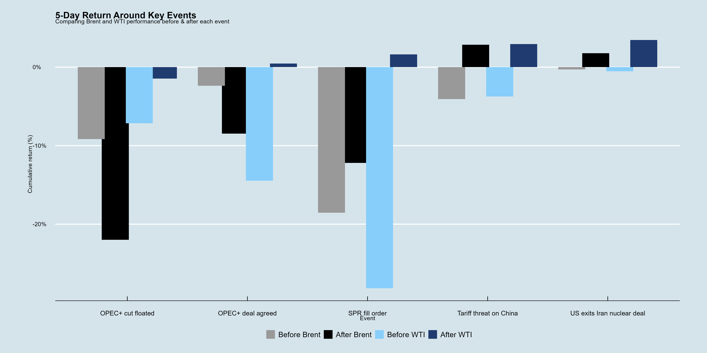

# Oil Markets under a Second Trump Presidency  

This repository presents a reproducible analysis of **Brent and WTI crude oil markets**, exploring how prices, volatility, and spreads evolve in response to policy shocks and macro events.  
The guiding question is:  

> **What would oil markets look like under a second Trump presidency?**

---

## Why This Analysis Matters  

- **Energy security & geopolitics**  
  Oil markets are highly sensitive to U.S. policy — from Iran sanctions to OPEC+ negotiations. A Trump presidency implies a return to aggressive trade, tariff, and energy policies, which can shift both demand expectations and supply alignments.  

- **Market stability**  
  Investors, policymakers, and firms need to understand how volatility and spreads behave in times of policy uncertainty.  

- **Risk transmission**  
  By quantifying how WTI returns co-move with the VIX and with Brent–WTI spreads, we see how financial stress and global oil benchmarks interact.  

---

## Methods & Outputs  

All analysis is reproducible in **R**. Below are the generated figures.  

### Price Dynamics & Key Events  
  
  

### Volatility & Betas  
  
  

### Event Returns  
  

---

## Key Findings  

- **Volatility risk**  
  Trump’s first term coincided with unprecedented volatility, culminating in the April 2020 negative oil price episode. A second term could amplify uncertainty through renewed sanctions, tariffs, and deregulation.  

- **Spread dynamics**  
  The Brent–WTI spread remains a structural barometer. Its widening during Trump’s trade disputes and during COVID which underscores how U.S. shale, transport bottlenecks, and global demand all collide in spread behaviour.  

- **Event-driven asymmetry**  
  Pre/post 5-day returns show Brent and WTI do not always move symmetrically. For instance, U.S. policy shocks often hit WTI harder, while global shocks (e.g., OPEC+) move both benchmarks.  

- **Financial linkages**  
  WTI’s beta to the VIX increases in stressed periods, showing stronger integration of oil into global risk cycles. A second Trump presidency could see tighter coupling of oil with financial volatility, not looser.  

---

## Independent Reflections  

1. **Policy signalling matters as much as policy substance.**  
   Markets reacted sharply to announcements (e.g., tariffs on China, SPR fill order) even before concrete measures took effect. A Trump 2.0 presidency would likely generate frequent signalling shocks.  

2. **Volatility is policy-contingent, not just structural.**  
   While COVID was the ultimate driver of the 2020 collapse, Trump’s confrontational stance towards OPEC and allies amplified uncertainty, adding layers of policy-driven risk.  

3. **The U.S. benchmark (WTI) is uniquely exposed.**  
   Brent, as a global benchmark, tends to buffer geopolitical risk. WTI, tied more to U.S. domestic production and storage, amplifies U.S. policy volatility.  

---

## Limitations  

- **Data coverage**:  
  The analysis uses public daily price data up to 2025. Futures curves, options-implied volatility, and physical flow data are not included.  

- **Attribution**:  
  Correlation does not imply causation. While event annotations help, isolating the causal impact of a Trump policy vs global conditions requires formal econometric identification.  

- **Generalisation**:  
  Past performance under Trump’s first presidency may not fully predict a second. Market structure (e.g., shale dynamics, OPEC+ cohesion, energy transition) has shifted since 2020.  

- **VIX as proxy**:  
  The VIX is an imperfect measure of global risk sentiment, especially for commodity-specific shocks. Other indices (MOVE for bonds, EMBI for EM risk) could provide richer context.  

---

## Who Should Care  

- **Policy makers & regulators** → anticipate energy market impacts of U.S. foreign policy.  
- **Investors & risk managers** → understand how oil-linked assets respond to volatility spikes.  
- **Academics & analysts** → explore causal pathways between policy shocks and commodity markets.  

---
